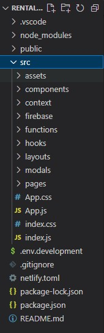
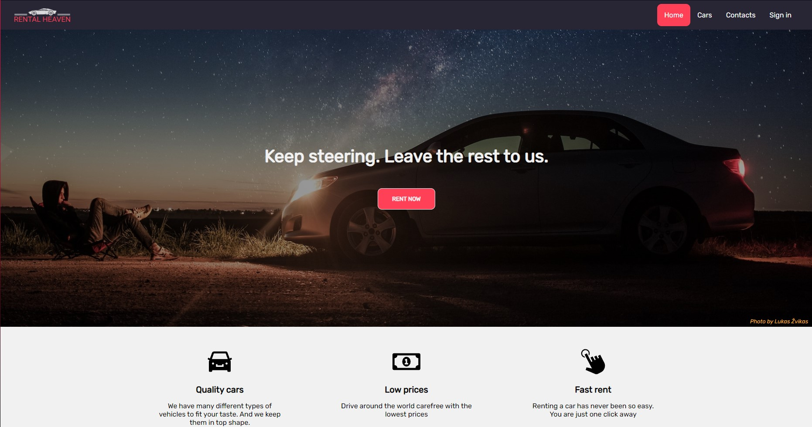
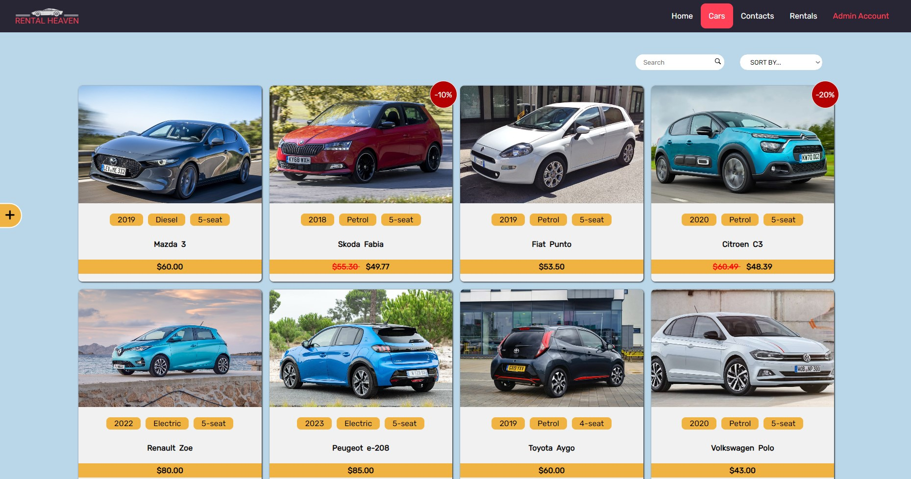
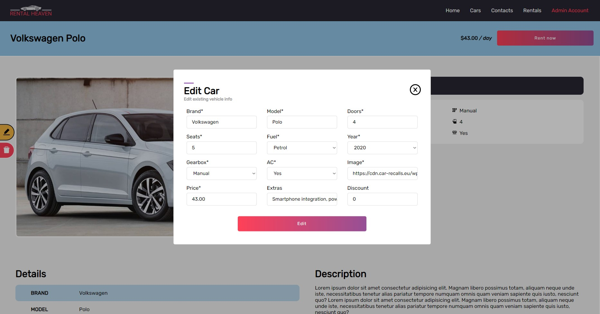
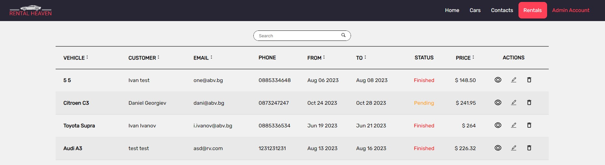
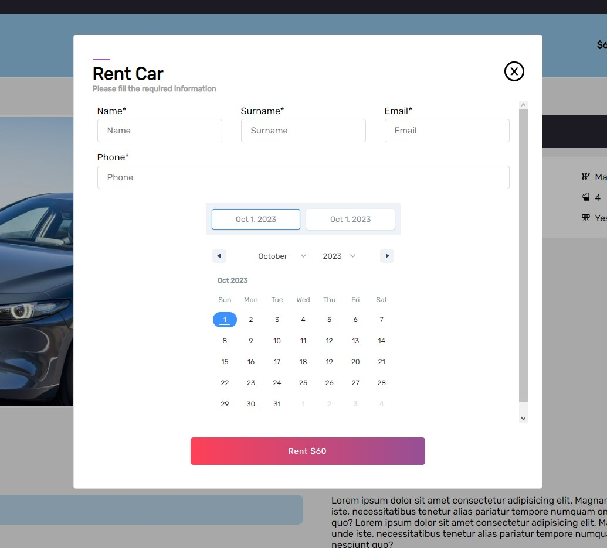

# Rental Heaven

A web application about renting cars that I developed while getting
used to React JS and Firebase. It has CRUD functionality, conditional
rendering based on the user's level of access and is completely
responsive. Pagination, search and filter options are implemented
alongside session storage, providing better user experience.

## Tech Stack

HTML, CSS, React, Firebase

## Demo

[Rental Heaven demo](zuma-rental-heavenn.netlify.app)

#### Demo Credentials

If you want to test out the renting functionallity you can create new account or use those listed bellow:

```
// User
email: user@abv.bg
password: 123123
```

If you want to test out the CRUD functionallity login as admin:

```
// Admin
email: admin_heaven@abv.bg
password: 123admin
```

ATTENTION !

```
Please DO NOT delete already existing items so there'd be always items for display.
Thank you!
```

## Features

All users

- Register/Login
- View the car catalog

Logged-in user

- Rent cars

Admin user

- Add car
- Edit car
- Delete car
- View all rented cars

## Folder Structure



## Some Code

#### Firebase config

```
import { initializeApp } from "firebase/app";
import { getFirestore } from "firebase/firestore";
import { getAuth } from "firebase/auth";

const firebaseConfig = {
  apiKey: process.env.REACT_APP_FIREBASE_API_KEY,
  authDomain: process.env.REACT_APP_FIREBASE_DOMAIN,
  projectId: process.env.REACT_APP_FIREBASE_PROJECT_ID,
  storageBucket: process.env.REACT_APP_FIREBASE_STORAGE_BUCKET,
  messagingSenderId: process.env.REACT_APP_FIREBASE_SENDER_ID,
  appId: process.env.REACT_APP_FIREBASE_APP_ID,
  measurementId: process.env.REACT_APP_FIREBASE_MEASURMENT_ID,
};

// Initialize Firebase
const app = initializeApp(firebaseConfig);
export const auth = getAuth(app);
export const db = getFirestore(app);
```

#### Fetch Items

- Calling useFetch hook

```
const { carList, setCarList, isLoading, setIsLoading, error, setError } = useCarContext();
useFetch(collection_cars, carList, setCarList, setIsLoading, setError);
```

- useFetch hook

```
import { useEffect } from "react";
import { db } from "../firebase/config";
import { getDocs, collection } from "firebase/firestore";

const useFetch = (
  colName = "",
  listContext = [],
  setListContext = () => {},
  setIsLoading = () => {},
  setError = () => {}
) => {
  useEffect(() => {
    const fetchData = async () => {
      if (listContext.length > 0) return;
      setIsLoading(true);
      try {
        const collectionRef = collection(db, colName);
        const dataList = await getDocs(collectionRef);
        const newData = [];
        dataList.docs.map((item) => newData.push({ ...item.data(), id: item.id }));
        if (dataList.docs.length === 0) {
          throw new Error("No data found");
        }
        setListContext(newData);
      } catch (error) {
        setError(error.message);
      } finally {
        setIsLoading(false);
      }
    };
    fetchData();
  }, [colName, listContext?.length, setIsLoading, setError, setListContext]);
};

export default useFetch;
```

#### Add, Update, Delete

```
import { db } from "./config";
import { collection, addDoc, doc, updateDoc, deleteDoc } from "firebase/firestore";
```

```
//ADD ITEM
export async function addItem(path, item) {
  try {
    const dataCollectionRef = collection(db, path);
    return await addDoc(dataCollectionRef, item).then((res) => {
      if (res) {
        return { status: res, error: null };
      } else {
        return { status: null, error: "Adding Item Failed!" };
      }
    });
  } catch (err) {
    return { status: null, error: err.message };
  }
}
```

```
//UPDATE ITEM
export async function updateItem(path, newItem, id) {
  const itemDocRef = doc(db, path, id);
  return await updateDoc(itemDocRef, newItem)
    .then(() => {
      return { item: { ...newItem, id }, error: null };
    })
    .catch((err) => {
      return { item: null, error: err.message };
    });
}
```

```
//DELETE ITEM
export async function deleteItem(path, item) {
  try {
    if (window.confirm(`Do you want to delete ${item.brand} ${item.model}?`)) {
      const itemDocRef = doc(db, path, item.id);
      await deleteDoc(itemDocRef);
      return { confirm: true, error: null };
    } else {
      return { confirm: false, error: null };
    }
  } catch (err) {
    return { confirm: false, error: err.message };
  }
}
```

#### Authentication functions

```
import { doc, setDoc } from "firebase/firestore";
import { auth, db } from "./config";
import {
  createUserWithEmailAndPassword,
  getAdditionalUserInfo,
  signInWithEmailAndPassword,
  signOut,
} from "firebase/auth";
import { signInWithPopup, GoogleAuthProvider, GithubAuthProvider } from "firebase/auth";
```

```
// REGISTER USER -FIREBASE-
export const registerUser = async (email, password) => {
  try {
    const response = await createUserWithEmailAndPassword(auth, email, password);
    return { user: response.user, message: null };
  } catch (err) {
    if (err.code === "auth/email-already-in-use") {
      return { user: null, message: "Account with this email already exists!" };
    }
    if (err.code === "auth/weak-password") {
      return { user: null, message: "Password should be at least 6 characters!" };
    }
    return { user: null, message: err.message };
  }
};
```

```
// LOGIN USER -FIREBASE-
export const loginUser = async (email, password) => {
  try {
    await signInWithEmailAndPassword(auth, email, password);
    return { success: true, message: "Login successfull" };
  } catch (err) {
    if (err.code === "auth/user-not-found" || err.code === "auth/wrong-password") {
      return { success: false, message: "Incorrect email or password!" };
    }
    return { success: false, message: err.message };
  }
};
```

```
//SIGN OUT USER -FIREBASE-
export async function signOutUser() {
  await signOut(auth);
}
```

#### Get Current User

```
import React, { createContext, useContext, useEffect, useState } from "react";
import { auth, db } from "../firebase/config";
import { onAuthStateChanged } from "firebase/auth";
import { doc, getDoc } from "firebase/firestore";
import { collection_users } from "../firebase/variables";

const AuthContext = createContext();

const AuthProvider = ({ children }) => {
  const [currentUser, setCurrentUser] = useState(null);

  useEffect(() => {
    onAuthStateChanged(auth, async (user) => {
      if (!user) return setCurrentUser(null);
      const docRef = doc(db, collection_users, user.uid);
      const userDetails = await getDoc(docRef);
      setCurrentUser({ ...userDetails.data(), uid: user.uid });
    });
  }, []);

  return <AuthContext.Provider value={{ currentUser }}>{children}</AuthContext.Provider>;
};

export const useAuthContext = () => useContext(AuthContext);
export default AuthProvider; // wraper
```

#### Pagination

```
import React, { useEffect, useMemo } from "react";
import "./Pagination.css";

const Pagination = ({ itemsPerPage, totalItems, currentPage, setCurrentPage }) => {
  //Calculates the number of pages
  const getPages = useMemo(() => {
    const pageNumbers = [];
    for (let i = 1; i <= Math.ceil(totalItems / itemsPerPage); i++) {
      pageNumbers.push(i);
    }
    return pageNumbers;
  }, [totalItems, itemsPerPage]);

  useEffect(() => {
    if (currentPage > getPages.length) {
      setCurrentPage(1);
    }
  }, [setCurrentPage, currentPage, getPages.length]);

  return (
    <div className="pagination">
      <button onClick={() => (currentPage > 1 ? setCurrentPage(currentPage - 1) : "")}>
        {"<<"}
      </button>

      {getPages.map((number) => (
        <button
          className={`${number === Number(currentPage) ? "active" : ""}`}
          key={number}
          onClick={() => setCurrentPage(number)}
        >
          {number}
        </button>
      ))}

      <button
        onClick={() => (currentPage < getPages.length ? setCurrentPage(currentPage + 1) : "")}
      >
        {">>"}
      </button>
    </div>
  );
};

export default Pagination;
```

#### Sort & Search

```
// Searching data
export const searchItems = (query, data) => {
  if (!query) return data;
  const _query = query.toLowerCase().trim();
  const excludedColumns = ["id", "img"];
  return data.filter((item) =>
    Object.keys(item).some((key) =>
      excludedColumns.includes(key) ? false : item[key].toString().toLowerCase().includes(_query)
    )
  );
};
```

```
// Sorting data
export const sortItems = (orderBy, data) => {
  if (orderBy === "default") return data;
  else if (orderBy.includes("ascending")) {
    return [
      ...data.sort(function (a, b) {
        return (
          cmp(a[orderBy.split(" ")[0]], b[orderBy.split(" ")[0]]) ||
          cmp(a[orderBy.split(" ")[1]], b[orderBy.split(" ")[1]])
        );
      }),
    ];
  } else if (orderBy.includes("descending")) {
    return [
      ...data.sort(function (a, b) {
        return (
          cmp(b[orderBy.split(" ")[0]], a[orderBy.split(" ")[0]]) ||
          cmp(b[orderBy.split(" ")[1]], a[orderBy.split(" ")[1]])
        );
      }),
    ];
  }
};

function cmp(a, b) {
  if (a > b) return 1;
  if (a < b) return -1;
}
```

#### Modal component base

```
import React, { useCallback, useEffect, useState } from "react";
import "./Modal.css";
import { AiOutlineCloseCircle as CloseButton } from "react-icons/ai";
import Button from "../components/Button";
import useBlockScroll from "../hooks/useBlockScroll";

const Modal = ({
  title = String,
  subtitle = String,
  body = React.Element,
  buttonLabel = String,
  buttonType = "submit",
  buttonClick,
  isOpen = Boolean,
  onClose = Function,
  onSubmit = Function,
}) => {
  // additional state for the hide/show animation
  const [showModal, setShowModal] = useState(isOpen);
  const { blockScroll, allowScroll } = useBlockScroll();

  useEffect(() => {
    setShowModal(isOpen);
    if (isOpen) blockScroll();
    if (!isOpen) allowScroll();
    // eslint-disable-next-line react-hooks/exhaustive-deps
  }, [isOpen]);

  const handleClose = useCallback(() => {
    setShowModal(false);
    //adding timeout because of the animation's length -  300ms
    setTimeout(() => {
      onClose();
    }, 300);
  }, [onClose]);

  const handleSubmit = useCallback(
    (e) => {
      e.preventDefault();
      onSubmit(e);
      handleClose();
    },
    // eslint-disable-next-line react-hooks/exhaustive-deps
    [onSubmit]
  );

  if (!isOpen) return null;
  return (
    <div className="modal-container">
      <form
        onSubmit={handleSubmit}
        className={`modal ${showModal ? "animation-show" : "animation-hide"}`}
      >
        <div className="modal__header">
          <h2 className="modal__title">
            {title}
            <div className="modal__close-btn" onClick={handleClose}>
              <CloseButton />
            </div>
          </h2>

          <h5 className="modal__subtitle">{subtitle && subtitle}</h5>
        </div>
        <div className="modal__body">{body}</div>
        <div className="modal__submit-btn">
          <Button type={buttonType} label={buttonLabel} onClick={buttonClick} />
        </div>
      </form>
    </div>
  );
};

export default Modal;
```

## Screenshots









