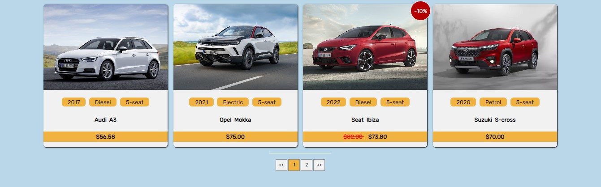
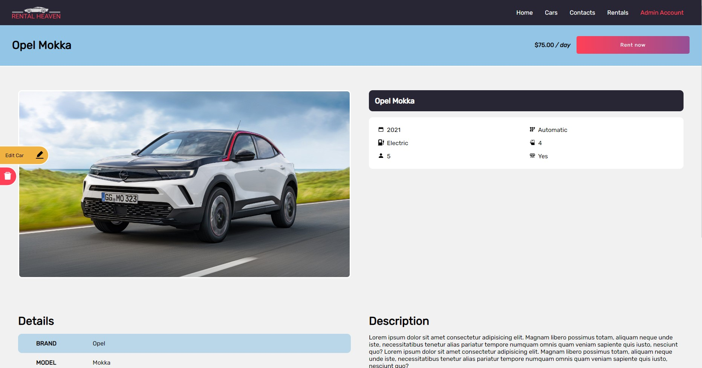

# Rental Heaven

A web application about renting cars that I developed while getting
used to React JS and Firebase. It has CRUD functionality, authentication, conditional
rendering based on the user's level of access and is completely
responsive. Pagination, search and filter options are implemented
alongside session storage, providing better user experience.

## Tech Stack

HTML, CSS, React JS, Firebase

## Demo

[Rental Heaven demo](zuma-rental-heavenn.netlify.app)

#### Demo Credentials

If you want to test out the renting functionallity you can create new account or use those listed bellow:

```
// User
email: user@abv.bg
password: 123123
```

If you want to test out the CRUD functionallity login as admin:

```
// Admin
email: admin_heaven@abv.bg
password: 123admin
```

ATTENTION !

```
Please DO NOT delete already existing items so there'd be always items for display.
Thank you!
```

## Features

All users

- Register/Login
- View the car catalog

Logged-in user

- Rent cars

Admin user

- Add car
- Edit car
- Delete car
- View all rented cars

## Folder Structure


## Screenshots






